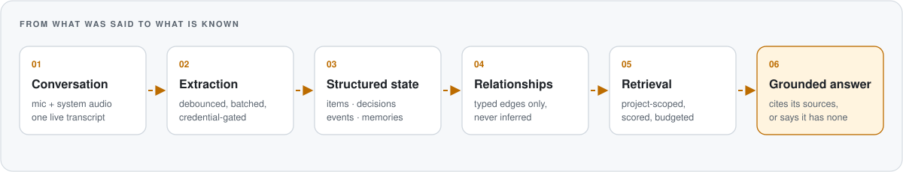
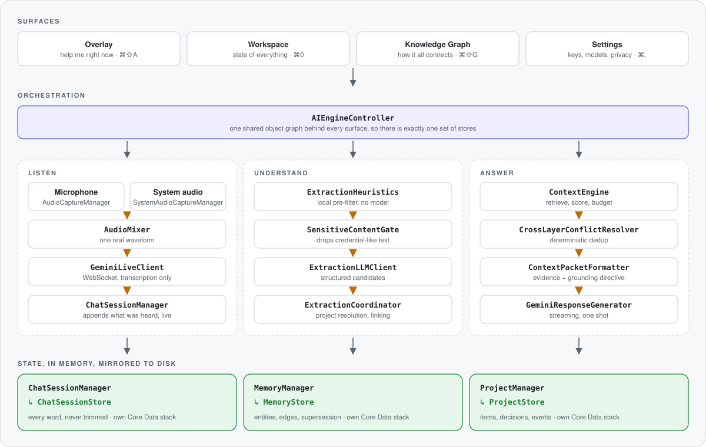
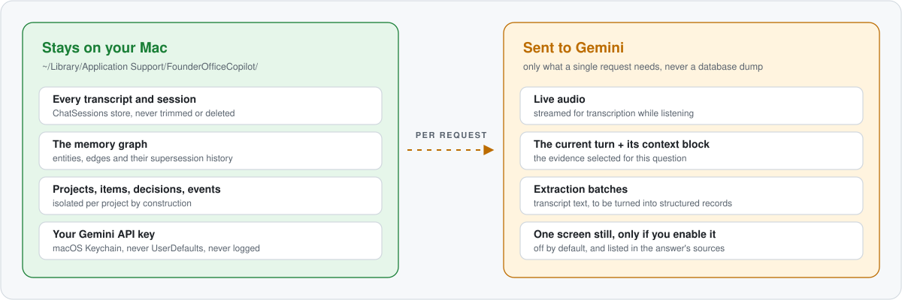

<div align="center">

<picture>
  <source media="(prefers-color-scheme: dark)" srcset="docs/assets/hero-dark.svg">
  
</picture>

<br>


[What it is](#what-friday-is) ·
[How it works](#how-it-works) ·
[Features](#features) ·
[Architecture](#architecture) ·
[Privacy](#privacy-and-data) ·
[Get started](#get-started) ·
[Tests](#tests) ·
[Limits](#known-limits)

</div>

## What Friday is

Friday is a menu-bar app for macOS that sits in on your meetings. It transcribes what is said,
turns it into structured knowledge about your projects (what exists, what was decided, what
happened), and answers your questions from that knowledge. When it has nothing stored about
what you asked, it says so instead of making something up.

It is built as the `FounderOfficeCopilot` Xcode target, and it is a personal project: one
developer, one Mac, your own Gemini API key.

Three things set it apart from a chat window in front of a model:

- **The conversation is only the input.** Most of the app is deterministic Swift that extracts,
  stores, scopes, retrieves and budgets. The model is one stage in that pipeline.
- **Projects are hard boundaries.** Evidence for one project is never in the pool another
  project's answer is built from. This is enforced by how retrieval is written, not by a prompt.
- **Your knowledge lives on your Mac.** Three local Core Data stores hold everything. Only what a
  single request needs is sent out.

## How it works

<picture>
  <source media="(prefers-color-scheme: dark)" srcset="docs/assets/pipeline-dark.svg">
  
</picture>

1. **Conversation.** The microphone and the system audio are mixed into one waveform and
   streamed to Gemini Live, which is used for transcription only.
2. **Extraction.** A local filter decides what is worth a model call. Text that looks like a
   credential is dropped. The rest is batched and sent for structured extraction.
3. **Structured state.** What comes back is typed records, not remembered text: project items,
   decisions, events and memory edges, each with a status and a timestamp.
4. **Relationships.** A newer fact marks an older one as superseded instead of overwriting it, so
   "what did we think before?" stays answerable. No link is ever inferred from similar wording.
5. **Retrieval.** When you ask, candidates are drawn from the active project only, scored for
   relevance, checked against the time frame of the question, and cut to a character budget.
6. **Grounded answer.** The selected evidence goes to the model with a directive that depends on
   whether it actually covers the question. The answer lists the sources it used.

## Features

| | |
|---|---|
| **Always-on transcription** | Mic and system audio together, so both sides of a call are heard. |
| **Answers on demand** | Press <kbd>⌘</kbd><kbd>⇧</kbd><kbd>R</kbd> and everything heard since the last answer becomes the question. The reply streams in. |
| **Persistent memory** | An entity and edge graph with supersession. History is kept, never overwritten. |
| **Project intelligence** | Projects, items, decisions and events, kept apart from each other by construction. |
| **Multi-meeting recall** | Knowledge attaches to the project, not the meeting, so many sessions feed one picture. |
| **Says when it does not know** | Answers are gated on whether the stored evidence covers the question. |
| **Knowledge graph** | A deterministic graph of the same data. The same database always draws the same picture. |
| **Workspace** | Home, Chat, Projects, Work, Decisions, People, Timeline and Knowledge Graph, with one search across all of them. |
| **Screen context, opt-in** | One downscaled still of your screen can go with a request. It is off by default. |

### Shortcuts

| Shortcut | Action | Works when |
|---|---|---|
| <kbd>⌘</kbd><kbd>⇧</kbd><kbd>A</kbd> | Show or hide the overlay | anywhere |
| <kbd>⌘</kbd><kbd>⇧</kbd><kbd>R</kbd> | Respond now | anywhere |
| <kbd>⌘</kbd><kbd>⇧</kbd><kbd>V</kbd> | Make the overlay visible in screenshots and screen shares | anywhere |
| <kbd>⌘</kbd><kbd>0</kbd> | Open the workspace | menu-bar menu |
| <kbd>⌘</kbd><kbd>⇧</kbd><kbd>G</kbd> | Open the project graph | menu-bar menu |
| <kbd>⌘</kbd><kbd>,</kbd> | Settings | menu-bar menu |

## Architecture

<picture>
  <source media="(prefers-color-scheme: dark)" srcset="docs/assets/architecture-dark.svg">
  
</picture>

Every surface shares one `AIEngineController` and therefore one set of stores. The three stores
are separate Core Data stacks that refer to each other by plain `UUID`, never by a Core Data
relationship. That is what keeps each layer independently testable and deletable.

<details>
<summary><b>How project isolation works</b></summary>

<br>

`ProjectResolution` answers "which project is this about?" in four tiers. The write path
(extraction) and the read path (retrieval) call the same implementation, so they cannot drift
apart.

| Tier | Signal | Result |
|:--:|---|---|
| 1 | The session is linked to a project | Authoritative |
| 2 | A project is named in the text | Must match an existing project exactly |
| 3 | Exactly one strong item match | Zero or several matches give nothing, never a guess |
| 4 | None of the above | No project, so no project evidence |

Retrieval then draws candidates only from the resolved project. It is also always driven by the
session being recorded, not the one you are browsing, so scrolling through another meeting while
an answer is being written cannot leak that meeting's project into it.

</details>

<details>
<summary><b>How it avoids inventing answers</b></summary>

<br>

The obvious rule, "say you don't know when retrieval comes back empty", does not work, because
retrieval is rarely empty. An off-topic question that shares one generic word with a stored fact
gets a non-empty result and a confident, invented answer.

`ContextPacketFormatter` instead measures how much of the question's distinctive wording the
evidence covers, with generic words removed. When coverage is too low, the model is told not to
invent project-specific knowledge. The directive covers the stored-context block only, so general
questions are still answered normally.

A follow-up like "and why?" has no distinctive words of its own. In that one case the top-scored
items and decisions are admitted, because the subject lives in the conversation, not the question.

</details>

<details>
<summary><b>How conflicts and duplicates are settled</b></summary>

<br>

The same fact can exist as a memory, a project item and a decision. `CrossLayerConflictResolver`
settles this using only fields that already exist: a decision's `relatedItemID`, a memory edge's
predicate, and timestamps. It is not a model asked to spot contradictions. When none of those
signals fire, both sides are kept. A decision never loses.

</details>

<details>
<summary><b>How the context is budgeted</b></summary>

<br>

| Control | Value |
|---|---|
| Recent conversation | 20 messages |
| Conversation budget | 24,000 characters |
| Evidence budget | 6,000 characters |

The current turn is kept ahead of older history, the newest text wins when a message only partly
fits, and nothing is inserted to mark a cut. The full transcript on disk is never changed by any
of this. Budgets are counted in characters because the project has no tokenizer dependency.

</details>

<details>
<summary><b>How the graph stays honest</b></summary>

<br>

The graph is four pure layers under a thin view: `GraphSnapshotBuilder`, `GraphFilter`,
`GraphLayoutEngine`, `GraphView`. Two rules hold throughout:

- **No fabricated edges.** Every edge reads a stored field that holds the other end's id.
- **No silent repair.** A dangling or cross-project link becomes a visible integrity issue in the
  inspector, and no edge is drawn.

Layout is closed-form, not force-directed, so it is fast and repeatable. The scale test lays out
1,041 nodes and 3,020 edges in about 8 ms.

</details>

The full write-up is in [ARCHITECTURE.md](mac-overlay/ARCHITECTURE.md), and the phase-by-phase
history, including what was tried and dropped, is in [PHASES.md](mac-overlay/PHASES.md).

## Privacy and data

<picture>
  <source media="(prefers-color-scheme: dark)" srcset="docs/assets/data-boundary-dark.svg">
  
</picture>

Friday stores everything locally, but it is not an offline app. Transcription, extraction and
answers are all done by Google's Gemini API, using your own key.

- **Storage** is three SQLite stores under `~/Library/Application Support/FounderOfficeCopilot/`.
- **The API key** is kept in the macOS Keychain. It is never written to `UserDefaults` and never
  logged.
- **Screen context is off by default.** During testing it once uploaded a screenshot that showed
  an open `.env` file, and on another run it made the assistant answer about unrelated code that
  happened to be on screen. When you turn it on, each answer lists the screenshot as a source.
- **The overlay is hidden from screen capture** (`NSWindow.sharingType = .none`), so it does not
  appear in your own screenshots or screen shares. <kbd>⌘</kbd><kbd>⇧</kbd><kbd>V</kbd> makes it
  visible.

> [!IMPORTANT]
> Friday transcribes everyone on a call, not only you. Recording and transcription laws differ by
> place, and many require the consent of every participant. Tell the people you are meeting with,
> and follow the rules of your workplace and of the meeting.

## Get started

**You need**

- macOS 13 or later. Screen context needs macOS 14.
- A full Xcode install. The Command Line Tools alone do not include the SDK and XCTest this
  project uses.
- A Gemini API key from [aistudio.google.com/app/apikey](https://aistudio.google.com/app/apikey).

**Build and run**

```bash
git clone https://github.com/thisisshivamtiwari/friday.git
cd friday/mac-overlay
open FounderOfficeCopilot.xcodeproj
```

In Xcode, select the `FounderOfficeCopilot` target, choose your own team under
*Signing & Capabilities*, and run. Or build from the command line:

```bash
export DEVELOPER_DIR="/Applications/Xcode.app/Contents/Developer"   # your Xcode path

xcodebuild -project FounderOfficeCopilot.xcodeproj \
           -scheme FounderOfficeCopilot -configuration Debug build
```

**First launch**

1. Friday appears in the menu bar, not the Dock.
2. Open Settings (<kbd>⌘</kbd><kbd>,</kbd>) and paste your Gemini API key.
3. Allow **Microphone** when asked. Allow **Screen Recording** as well: macOS requires it for
   capturing system audio, which is how Friday hears the other side of a call.
4. Choose *Start listening* from the menu, then press <kbd>⌘</kbd><kbd>⇧</kbd><kbd>R</kbd>
   whenever you want an answer.

## Tests

```bash
cd mac-overlay/AutomatedTests
swift test        # with DEVELOPER_DIR set as above
```

697 tests run in about 7 seconds: 696 pass, and one is skipped because it needs a Screen
Recording permission that a test runner cannot hold.

- **They test the shipped code.** `Sources/` is a folder of symlinks into the app's own source
  files, not a copy.
- **They are offline.** No test makes a network call. The Gemini clients sit behind protocols,
  and tests inject stubs and a nil API key.
- **They can be deleted.** The Xcode project does not reference `AutomatedTests/`, so removing
  the folder has no effect on the app.

Coverage is concentrated where state can be corrupted without anyone noticing: persistence and
write ordering, extraction decoding, decision linking, retrieval and admission, grounding, and
graph projection on adversarial shapes such as cycles, dangling links and near-identical names.

The audio hardware, global hotkeys, the overlay window and a live Gemini session are not covered
and need testing by hand. `AutomatedTests/api-protocol-scripts/` holds Python scripts that
exercise the Gemini protocol against the real API; see
[its README](mac-overlay/AutomatedTests/README.md).

## Repository layout

```
friday/
├── README.md
├── docs/
│   ├── assets/                    the diagrams above, in light and dark
│   └── generate_assets.py         regenerates them
└── mac-overlay/
    ├── FounderOfficeCopilot/      the app: 75 Swift files, about 15,000 lines
    ├── FounderOfficeCopilot.xcodeproj
    ├── AutomatedTests/            standalone SPM test package
    │   ├── Sources/               symlinks into the app sources
    │   ├── Tests/                 41 XCTest files
    │   └── api-protocol-scripts/  Gemini protocol checks, in Python
    ├── ARCHITECTURE.md
    └── PHASES.md
```

<details>
<summary><b>Where each part of the code lives</b></summary>

<br>

| Area | Types |
|---|---|
| Audio and transcription | `AudioCaptureManager`, `SystemAudioCaptureManager`, `AudioMixer`, `GeminiLiveClient` |
| Conversation | `ChatSession`, `ChatSessionManager`, `ChatSessionStore`, `SessionSearch` |
| Orchestration | `AIEngineController`, `GeminiResponseGenerator` |
| Memory | `MemoryEntity`, `MemoryEdge`, `MemoryManager`, `MemoryStore`, `EpisodeSummary` |
| Extraction | `ExtractionHeuristics`, `SensitiveContentGate`, `ExtractionLLMClient`, `ExtractionCoordinator` |
| Projects | `Project`, `ProjectItem`, `Decision`, `ProjectEvent`, `ProjectSessionLink`, `ProjectManager`, `ProjectStore`, `ProjectResolution` |
| Retrieval and context | `KeywordGraphRetrievalProvider`, `RelevanceScoring`, `TemporalQueryClassifier`, `CrossLayerConflictResolver`, `ContextEngine`, `ContextPacketFormatter` |
| Graph | `GraphSnapshotBuilder`, `GraphFilter`, `GraphLayout`, `GraphView`, `GraphInspector` |
| Workspace UI | `MainWindow`, `WorkspaceModel`, `HomeView`, `ProjectsView`, `TimelineView`, `EntityInspector`, `DesignSystem` |
| Overlay | `PrivateOverlayWindow`, `PrivateOverlayView`, `AvatarBlobView`, `HotKeyManager` |

</details>

<details>
<summary><b>Adding a Swift file</b></summary>

<br>

The project predates Xcode's file-system-synchronized groups, so a new file has to be registered
in `project.pbxproj` by hand: a `PBXFileReference`, a `PBXBuildFile`, membership in the group, and
an entry in the `PBXSourcesBuildPhase` list. To put it under test, add a symlink to it in
`AutomatedTests/Sources/FounderOfficeCopilotCore/`.

</details>

## Known limits

- **Retrieval is keyword and graph based.** There are no embeddings, so a question phrased very
  differently from the stored fact can miss it.
- **Friday is never proactive.** It answers when asked and does not speak up on its own.
- **Decision-to-item links are sparse.** The linking logic is tested, but the model rarely names
  the related item, so most links come from a fallback on the decision's own text.
- **Screen context uses the first display only**, and does nothing on macOS 13.
- **The models are Gemini previews.** Model ids are retired from time to time. Both the
  transcription model and the response model can be changed in Settings.
- **Not notarized or packaged.** You build it yourself, with your own signing team.

## Roadmap

| | |
|---|---|
| Next | Semantic retrieval alongside the keyword and graph provider |
| Later | Personalization and polish |
| Later | Proactive behaviour: Friday raising something without being asked |

---

<div align="center">

The conversation is the input. The knowledge is the product.

</div>
